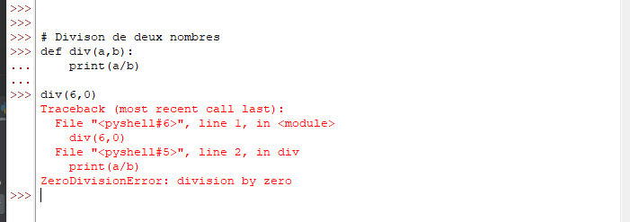

## Mon travail portera sur les exception en Python.
## Introduction
Software is a series of organized logical instructions, it often happens
that these instructions do not follow the logic (Division of a number by zero),
so in an error will be generated. these errors are called exception, 
they are of several types (the Exception provided by the language,
 custom exceptions...).

The purpose of the exceptions is to carry out processing
specific to the events that caused this exception.
You should also know that an exception is different from a syntax error.

## Présentation du concept
An exception is the interruption of program execution following a particular event.
i.e. even if a statement or an expression is syntactically
correct, it can cause errors during execution,
these errors detected during execution are called exceptions.
Exceptions are not a fatality, they give more
information about the error generated.
A short text to illustrate this introduction,
in this case divide a number by zero


The last line of the image names the class of the exception and the error message
this image also gives us the line where the error occurred...
## Théorie
Exception management theory in Python revolves around handling unexpected errors or issues that occur during program execution. An exception is an event that disrupts the normal flow of a program, causing it to terminate immediately.

Python provides various built-in exceptions like TypeError, ValueError, NameError, IndexError, and so on which are raised when a program encounters an error.

The main objective of exception handling is to make the program more robust and ensure that it doesn't crash in the event of an error. Exception handling involves three main components:

1. Try: It is a block of code where you place the code that might raise an exception.

2. Except: It is a block of code where you handle the exception raised in a try block.

3. Finally: This block contains code that is executed irrespective of whether an exception occurs or not.

Here is an example of how exception handling works in Python:

```
try:
num = int(input("Enter a number: "))
result = 100 / num
print(result)
except ZeroDivisionError:
print("Cannot divide by zero!")
except ValueError:
print("Please enter a valid number!")
else:
print("No exceptions occurred.")
finally:
print("Program execution completed.")
```

In this example, we first take input from the user and convert it to an integer. Then we divide 100 by the input number and print the result. If the input is zero, we catch the ZeroDivisionError and print an appropriate message. Similarly, if the input is not a valid number, we catch the ValueError.

If no exception is raised, the else block is executed, where we print a message saying that no exception occurred. Finally, the finally block is executed, which prints a message indicating that the program has completed its execution.

Therefore, exception management theory in Python is essential for writing reliable and robust code that can handle unexpected errors gracefully.

## exemple pratique
## potentielles alternatives
## des cas d’utilisation concrets en rapport avec l’analyse de données
## une conclusion et enfin la liste des ressources consultées
– en bref, faites preuve de clarté, de précision, d’organisation et de créativité