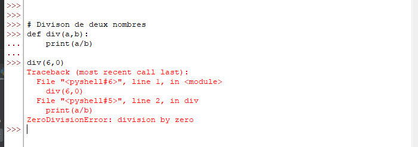
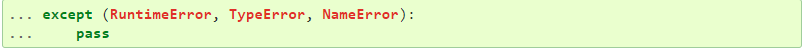
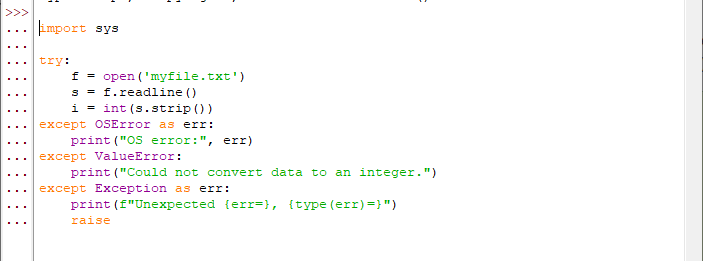
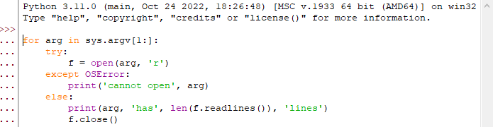
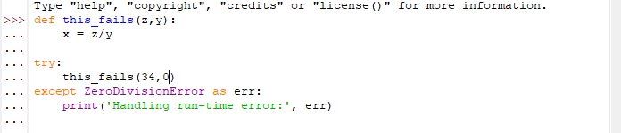
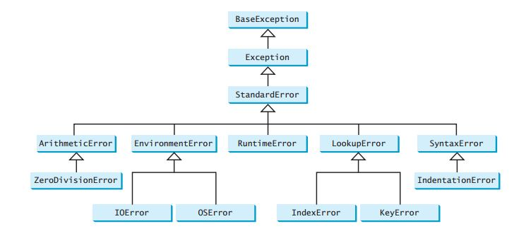
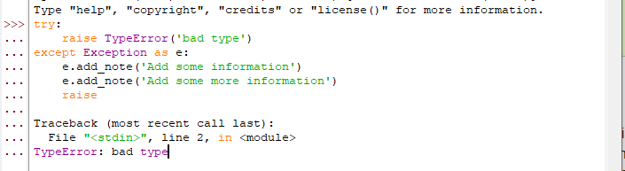
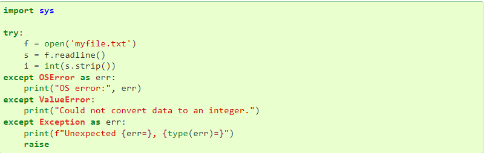

## Mon travail portera sur les exception en Python.  


## 1. Introduction
[link](google.com)  
Software is an organized sequence of logical instructions, this often happens
that these instructions do not follow the logic (Division of a number by zero), in this case an error will be generated. these errors are called exception.
In Python, an error can be a syntax error or an exception.

The purpose of exceptions is to process
specific to the events that caused this exception.

## 2. What is the Exception?
An exception is the interruption of program execution following a particular event.
i.e. even if a statement or an expression is syntactically
correct, it can cause errors during execution,
these errors detected during execution are called exceptions.
Exceptions are not a fatality, they give more
information about the error generated.
A short text to illustrate this introduction,
in this case divide a number by zero




The last line of the image names the class of the exception and the error message
this image also gives us the line where the error occurred...

## 3. Exception handling

**Exception** management theory in Python revolves around handling unexpected errors or issues that occur during program execution. An exception is an event that disrupts the normal flow of a program, causing it to terminate immediately.

Python provides various built-in exceptions like TypeError, ValueError, NameError, IndexError, and so on which are raised when a program encounters an error.

The main objective of exception handling is to make the program more robust and ensure that it doesn't crash in the event of an error. Exception handling involves three main components:

+ **Try**: It is a block of code where you place the code that might raise an exception.

+ **Except**: It is a block of code where you handle the exception raised in a try block.

+ **Finally**: This block contains code that is executed irrespective of whether an exception occurs or not.

Here is an example of how exception handling works in Python:

```
try:
num = int(input("Enter a number: "))
result = 100 / num
print(result)
except ZeroDivisionError:
print("Cannot divide by zero!")
except ValueError:
print("Please enter a valid number!")
else:
print("No exceptions occurred.")
finally:
print("Program execution completed.")
```

In this example, we first take input from the user and convert it to an integer. Then we divide 100 by the input number and print the result. If the input is zero, we catch the ZeroDivisionError and print an appropriate message. Similarly, if the input is not a valid number, we catch the ValueError.

If no exception is raised, the else block is executed, where we print a message saying that no exception occurred. Finally, the finally block is executed, which prints a message indicating that the program has completed its execution.

Therefore, exception management theory in Python is essential for writing reliable and robust code that can handle unexpected errors gracefully.
An except clause can name multiple exceptions as a tuple in parentheses, for example:




the word pass means that the exception will not be treated
Exception can be used as a wildcard that catches (almost) everything. However, it is recommended that we be as specific as possible with the types of exceptions we intend to handle and allow any unexpected exceptions to propagate.

The most common Exception handling model is to print or log the exception and then rethrow it (allowing a caller to also handle the exception).




We can use else in a try, It is useful for code that needs to be executed if the try clause does not throw an exception. For example:




If a function is called in a try and this function generates an error
then this error will be catch  in the try.



you should know that all exceptions inherit from the class `BaseException`



## 4. Raising Exceptions

In Python, exceptions are raised when there is an error or an unusual event occurs during the execution of a program. These exceptions can be raised explicitly by the programmer using the keyword "raise".

Syntax:

```
raise <ExceptionType>(<error_message>)
```

Here, `<ExceptionType>` refers to the type of exception that needs to be raised, and `<error_message>` is an optional parameter that gives additional information about the exception.

Let's consider an example where we explicitly raise an exception for division by zero.

```python
x = 5
y = 0

try:
if y == 0:
raise ZeroDivisionError("Cannot divide by zero.")
else:
z = x/y
print(z)
except ZeroDivisionError as e:
print(e)
```

Output:

```
Cannot divide by zero.
```

In the above code, we check if the divisor `y` is zero, and if it is, we raise a `ZeroDivisionError` with a custom message. The exception is then caught by the `except` block and the error message is printed to the console.

We can also use multiple `except` blocks to handle different types of exceptions that may be raised.

```python
try:
# some code
except ZeroDivisionError:
# code to handle ZeroDivisionError
except TypeError:
# code to handle TypeError
except:
# code to handle other exceptions
```

The first `except` block will handle only `ZeroDivisionError`, the second `except` block will handle only `TypeError`, and the last `except` block will handle all other types of exceptions.

In conclusion, raising exceptions in Python allows programmers to handle errors and unusual events during the execution of a program. By using the `raise` keyword, custom exceptions with informative messages can be raised, which can be caught and handled using the relevant `except` blocks.

## 5. Exception chaining
Exception chaining, also known as exception propagation or exception forwarding, is a mechanism in Python that enables the traceback of an exception to include information about the original cause of the exception. This can help developers understand the root cause of an error and can make debugging code easier.

In Python, exception chaining is typically done using the "raise from" syntax. Here is an example:

```
try:
some_function()
except OSError as err:
raise ValueError("Something went wrong with some_function()") from err
```

In this example, the "raises from" statement creates a new ValueError exception and associates it with the original OSError exception. When the ValueError exception is raised, the traceback will include information about both exceptions, making it easier to pinpoint the root cause of the error.

In addition to the "raise from" syntax, Python also provides the ability to manually set the __cause__ attribute of an exception to achieve similar results:

```
try:
some_function()
except OSError as err:
new_err = ValueError("Something went wrong with some_function()")
new_err.__cause__ = err
raise new_err
```

Regardless of the specific syntax used, the key idea behind exception chaining is to provide more context about an error by linking multiple exceptions together. By doing so, developers can more easily identify and fix the underlying issues that caused the error in the first place.


## 6. User-defined exceptions

In Python, an exception is an error that occurs during the execution of a program. These exceptions can be handled by using try and except blocks. However, sometimes you may want to define your own custom exceptions.

Defining a Custom Exception:
To define your own custom exception, you need to create a new class that inherits from the base Exception class. For example:

```python
class CustomException(Exception):
pass
```

Here, we first define a new class called CustomException which inherits from the built-in Exception class using the keyword "Exception". We then use the pass statement to indicate that our new class does not have any additional logic.

Raising a Custom Exception:
Once a custom exception has been defined, you can raise it like any other exception. For example:

```python
x = 10
if x > 5:
raise CustomException("x should not exceed 5.")
```

Here, we check if the value of x is greater than 5. If it is, we raise a new instance of our CustomException class with a descriptive message.

Handling a Custom Exception:
To handle a custom exception in a try...except block, you simply need to include the name of the custom exception class in the except statement. For example:

```python
try:
x = int(input("Enter a positive number: "))
if x < 0:
raise CustomException("Number should be positive.")
except CustomException as e:
print("Error: ", e)
```

Here, we ask the user to enter a positive number, and if they enter a negative number, we raise a new instance of our CustomException class. In the except block, we catch the CustomException and print out the error message associated with it.

Conclusion:

Python makes it easy to define and use custom exceptions. By defining your own exceptions, you can make your code more readable and easier to debug.

##  Defining Clean-up Actions

Clean-up actions refer to the set of instructions that must be executed after completing a specific task or process. These actions are crucial in ensuring that the resources used during the process are freed up and that the system is left in a clean state.

In Python, clean-up actions can be defined using the "try-finally" block. This block allows you to specify a set of instructions that must be executed regardless of whether an exception is raised or not. The syntax for using "try-finally" block is as follows:

```
try:
# Code that should be executed
finally:
# Clean-up code that must be executed
```

In this block, the code that must be executed is placed in the "try" block, while the clean-up code is placed in the "finally" block. The clean-up code will always be executed even if an exception occurs in the try block.

Here's an example of how you can define clean-up actions in Python:

```
file = open("example.txt", "r")
try:
# Do something with the file
data = file.read()
finally:
file.close()
```

In this example, the "file.close()" method is used to release the resources used by the open file. Regardless of whether the "try" block completes successfully or raises an error, the "file.close()" method will always be called to ensure that the file is closed properly.

## 7. Enriching Exceptions with Notes


When an exception is created in order to be raised, it is usually initialized with information that describes the error that has occurred. There are cases where it is useful to add information after the exception was caught. For this purpose, exceptions have a method add_note(note) that accepts a string and adds it to the exception’s notes list. The standard traceback rendering includes all notes, in the order they were added, after the exception.



In conclusion, adding notes to exceptions can be very helpful when trying to diagnose and fix errors in our code. We can add notes to the args tuple or create custom exception classes that include note attributes. By doing this, we can provide more context about what was happening when the exception occurred, which can make it easier to track down the root cause of the problem.

## 8. The place of exceptions in data analyst 

You can't make good functional code without exceptions, they occur
at all levels of programming. because a code always generates errors
which can be blocking. for example in data analyst when we load the files
exceptions must be used.



## 9. Conclusion

## Ressources  
[w3schools](https://www.w3schools.com/python/python_try_except.asp "w3schools")  
[insa](https://moodle.insa-rouen.fr/pluginfile.php/140992/mod_resource/content/4/Python-Exceptions.pdf "moodle.insa")